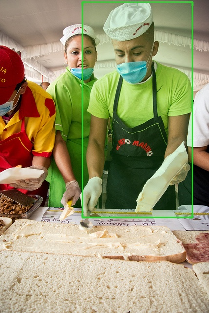
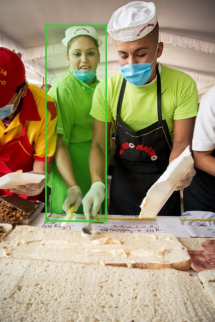
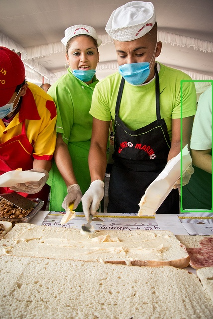
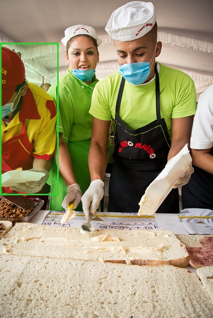
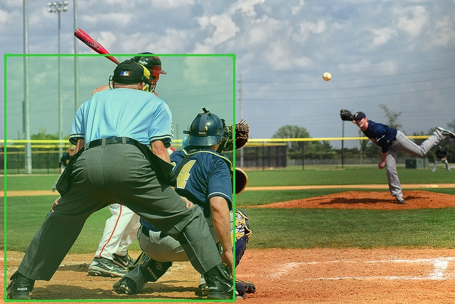
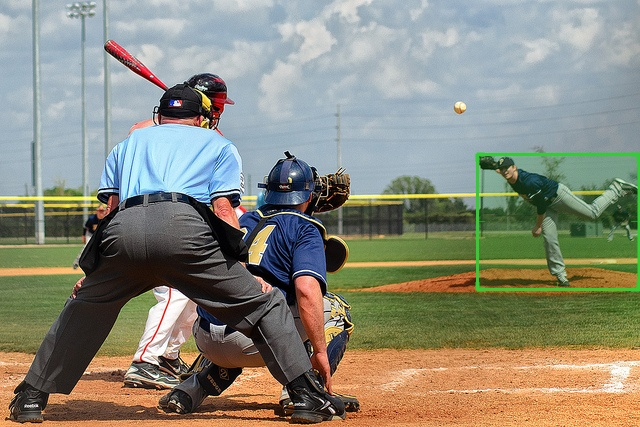
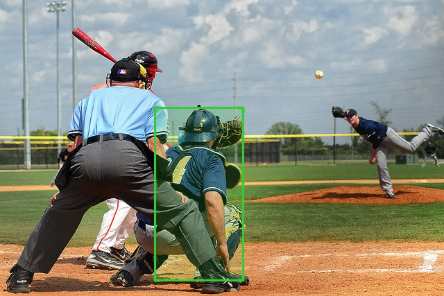
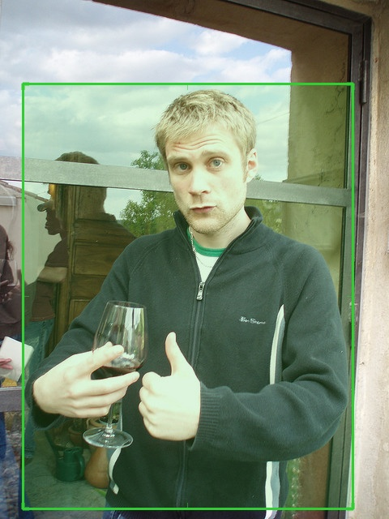
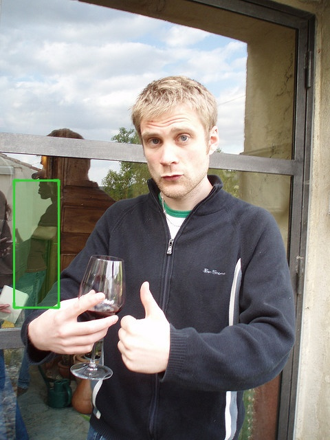
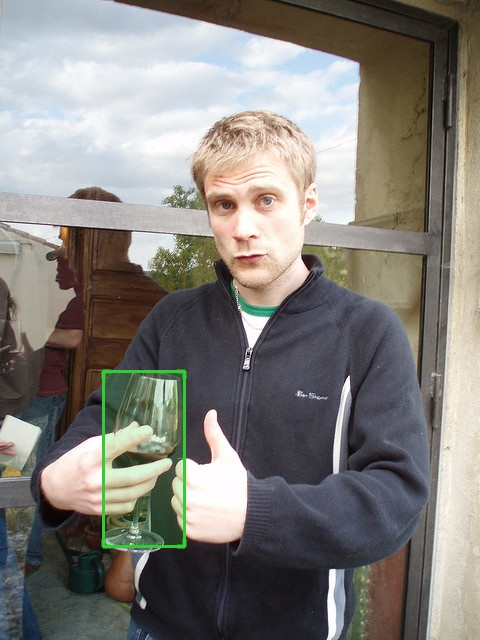

# clip-refcoco

## Abstract
Referring expression comprehension is a difficult task because it requires understanding the semantic meaning of the text enough to be able to localize specific objects in images. Motivated by the successful zero-shot capabilities of CLIP, a state-of-the-art vision and language neural network that can be used on arbitrary image classification tasks, we were interested in seeing CLIP’s localization abilities after fine-tuning CLIP on the RefCOCO and RefCOCO+ datasets. Because CLIP has little spatial reasoning off-the-shelf, we created multiple choice datasets where we drew colored bounding boxes with shading around the objects in the images. Using this setup, our fine-tuned CLIP models achieved a 0.5% improvement in accuracy on RefCOCO testA and a 2% improvement in accuracy on RefCOCO+ testA compared to previous methods. However, unlike previous models, we did not tailor our model architecture to specifically perform well on referring-expression-comprehension-related tasks. Instead, we demonstrate that we were able to achieve the best performance on this task by using a highly general model, CLIP, and fine-tuning it on images with colored bounding boxes drawn on them. We believe our approach has great potential for producing highly flexible models that can generalize to a great variety of tasks. 

## Problem

Referring expression comprehension is the task of localizing an object in an image based on a text description of that object. This task is important for aiding humans in simple real-world situations, such as by helping a robot navigate to a specific location in its field of vision or allowing a robot to recognize and pick up common household items. However, one big challenge for Vision-Language models on referring expression comprehension is the task of visual grounding, because it requires a solid understanding of the relationship between the language semantics and the image context. Furthermore, many off-the-shelf object detectors are pretrained on ImageNet, which was extremely expensive to collect and label and require fine-tuning on another expensive task-specific dataset in order to perform other tasks beyond just predicting the 1000 ImageNet object classes.

## Related Work

MAttNet: https://arxiv.org/pdf/1801.08186.pdf

Modular Attention Network (MAttNet) is a modular network for referring expression comprehension. It is designed for general referring expressions, which consists of 3 modules: subject (category name, color), location (absolute and some relative location) and relationship (subject-object relations). In addition, it pays close attention to “in-box” expression (an expression that mentions parts of the object itself) like “man in red shirt” as opposed to “out-box” (an expression that mentions other objects relative to it) attention like “cat on chair”. The authors of MAttNet have shared their datasets RefCOCO and RefCOCO+, which we used for our project. In the testing stage, the datasets offer person vs. object splits for evaluation, where “testA” includes the images containing multiple people and “testB” for images including multiple objects.
 
CLIP: https://openai.com/blog/clip/

CLIP (Contrastive Language–Image Pre-training) is a general-purpose visual classification neural network whose primary training task is to predict which out of a set of 32,768 randomly sampled text snippets, was actually paired with a given image in their dataset. The CLIP network mitigates the need for an extensive dataset, the narrowness of task-specific models, and the usually poor real-world performance of most state-of-the-art models. CLIP learns from unfiltered and noisy data, and is intended to be used in a zero-shot manner. Because CLIP learns visual concepts directly from natural language, it is significantly more flexible and general compared to existing ImageNet models, which is ideal for our training task since we will work on common object recognition and we don't have the massive resources to design and train a model from scratch.

CPT: https://arxiv.org/pdf/2109.11797.pdf

Cross-modal Prompt Tuning (CPT) also works on the MSCOCO datasets. It has two separate components of the task: a visual sub-prompt that marks the image regions with colored blocks or segmentation masks, and a textual sub-prompt that puts the query text into a color-based query template. We are also using colored bounding boxes on our images as our method of visual grounding.
 
## Methodology

Our approach is to build a text-image matching task by fine-tuning the CLIP model outlined in the paper Learning Transferable Visual Models From Natural Language Supervision (https://arxiv.org/pdf/2103.00020.pdf) on the RefCOCO dataset. Because CLIP is highly flexible and can achieve competitive zero-shot performance on a wide variety of tasks, we believe that we can design a multiple-choice dataset from RefCOCO that can be used to fine-tune CLIP to be able to achieve comparable performance to MAttNet and CPT. However, CLIP does not have good spatial reasoning when used off-the-shelf because it was pretrained to consider images in their entirety when trying to match them with their corresponding text and was not pretrained to identify specific regions in images. Therefore, we draw colored bounding boxes with shading on the region proposals of the COCO images in order to provide a tighter integration between the image region and the text description. We use a color transparency of 0.5, which seems to be around the optimal level according to the CPT paper.

We create our multiple-choice datasets out of RefCOCO and RefCOCO+. The difference between RefCOCO and RefCOCO+ is that RefCOCO+ contains more appearance-based referring expressions and excludes location-based expressions. Each record in our multiple-choice datasets contains one referring expression and *N* image IDs, where *N* is the number of region proposals in the image and each image ID refers to the same image but with a green bounding box and shading drawn around one of the *N* region proposals. Our RefCOCO multiple-choice training dataset has 120624 examples and our RefCOCO+ multiple-choice training dataset has 120191 examples.
We originally wanted each record to have *N* of the same referring expression text and only one image with the *N* bounding boxes, all with different colors, drawn on it, but the bounding boxes would overlap with each other too much which would confuse CLIP. 

---

  Here is an example of a text and images pair from RefCOCO testA, where N=9. These are region proposals predicted by Faster R-CNN. We only show 4 out of the 9 images here. In this example, the text best describes the 4th image from the left.
  

 Text: "far right person cut in half"
 
 Images:
 
 .
 
 
 
 
  
---

Using CLIP’s image preprocessor and text tokenizer, we first tokenize and preprocess our input. We create a CLIP classification head where we pass in our preprocessed input and use CLIP’s text and image encoders to obtain our text and image features, each with an encoding dimension of 768. Then we calculate the cosine similarity between the text and image encodings, as discussed in the CLIP paper, to produce the logits which is a vector of length *N*. We use PyTorch’s CrossEntropyLoss to calculate the loss. 

For training, we use COCO’s ground truth bounding boxes as region proposals. Also, because it requires a lot of gpus to fit all *N* images per record, we instead randomly choose 4 region proposals per epoch such that one of the region proposals is the ground truth bounding box and the model gets trained on different negative region proposals per epoch. For validation, we follow the fully automatic comprehension procedure as described in the MAttNet paper, where we use region proposals predicted by Faster R-CNN and consider a region proposal to be the target if its IoU with the ground truth region is greater than 0.5. We do use all *N* images per record for validation. 

## Experiments

We finetune our CLIP model on RefCOCO and RefCOCO+ using the ResNet-50 and Vision Transformer, denoted as RN50x16 and ViT-B/32, respectively. We then evaluate on the RefCOCO and RefCOCO+ testA datasets. We chose to evaluate on testA because other models seemed to perform better on it compared to the Val and testB datasets, and we wanted to compare our results with the best performance of previous models. Then we ensembled the RN50x16 and ViT-B/32 CLIP models by averaging the logits from the two model outputs and compared its results with the results of the two RN50x16 and ViT-B/32 CLIP models. 

We optimize our model using AdamW and a learning rate schedule with warmup that decreases linearly from our best initial learning rate of 8e-6 and a batch size of 64. We train for 5 epochs and save the model that achieved the highest accuracy during validation. 

## Results and Discussion

We compare our three CLIP models’ accuracies on the testA dataset of RefCOCO and RefCOCO+ with three other large models in the table shown below.

| Model | RefCOCO testA | RefCOCO+ testA|
| --- | --- | --- |
| MAttNet | 81.1 | 71.6 |
| CPT Finetuning | 87.2 | 80.8 |
| UNITER | 86.5 |81.3 |
| CLIP RN50x16 | **87.68** | 83.53 |
| CLIP ViT-B/32 | 84.09 | 78.83 | 
| CLIP Ensemble | 87.43 | **83.57** |

---
We now show some model predictions. The predicted images with the top 4 softmax scores are shown below.

Here are some examples that our CLIP ensemble model gets correct on RefCOCO testA:

1.

 * Text: "person in red"
 * Images:
 
 .
 
 
 
 
 
 * softmax percentages in order: 0.13, 0.08, 0.01, 99.77
 * predicted: last image from left
 * Our model was able to locate the person in red even with a green shading

2.

 * Text: "far right person cut in half"
 * Images:
 
 .
 
 
 
 
 
 * softmax percentages in order: 0.0, 0.0, 0.37, 99.62
 * predicted: last image from left
 * Our model was able to accurately locate the far right person who is cropped off.

Here is an example that our CLIP ensemble model gets incorrect on RefCOCO testA:

1.

 * Text: "sky blue shirt guy"
 * Images:
 
 .
 
 
 
 
 
 * softmax percentages in order: 0.0, 37.87, 0.3, 61.81
 * predicted: last image from the left
 * Our model predicted the navy blue shirt guy instead of the sky blue shirt guy. However, it did produce higher softmax scores for both blue shirt guys compared to the black shirt guy, so our model likely understands what "blue" looks like.

2.

 * Text: "wooden furniture behind man"
 * Images:
 
 .
 
 
 
 
 * softmax percentages in order: 1.72, 33.25, 65.03
 * predicted: last image from the left
 * Our model predicted the cup in the man's hand instead of the wooden furniture in the back. However, the chair is hard to see because of the reflection of the man in the window.

---

As shown in the table, our CLIP RN50x16 was the best model on RefCOCO testA and our CLIP Ensemble was the best model on RefCOCO+ testA. In fact, both our CLIP RN50x16 and CLIP Ensemble beat the other three previous models by just using the more general-purpose model CLIP and without tailoring our model architectures to do well on referring expression comprehension. It is interesting that our CLIP ViT-B/32 model performed the worst of the three, but still gave a 0.04% accuracy increase compared to CLIP RN50x16 when we ensemble the two models. We believe that fine-tuning CLIP and drawing colored bounding boxes with shading is a great strategy for localization, which makes it a promising method to achieve competitive performance on a variety of tasks. And this is the main advantage over previous models that are mainly competitive in one task but are less suited to other tasks. If we had more time on this project, we would verify the generalization capabilities of our method by fine-tuning on other datasets relating to grounded language understanding, such as Flickr30k and AVA Actions dataset.

## Future Work and Acknowledgements
In this project, we improved CLIP’s localization abilities by fine-tuning it on RefCOCO. We are now interested in seeing how our model would perform in a zero-shot manner on other tasks. We believe that making large models more flexible and generalizable to different tasks is a research direction that is more applicable to real-world situations compared to trying to marginally improve models on specific benchmarks each year. And zero-shot performing a variety of tasks accurately would be a strong measure of a model’s generalizability.

We used the distributed training and logging code from the huggingface transformers fine-tuning script, we used the CLIP logit scaling scheme from CLIP’s `model.py`, and we used the computeIoU function from the `pyEvalDemo` in the referring expressions repository. We specified the links to these sources in our files. We wrote the rest of the code, including the actual training, evaluating, ensembling, CLIP classifier head, and dataset creating and loading. 
